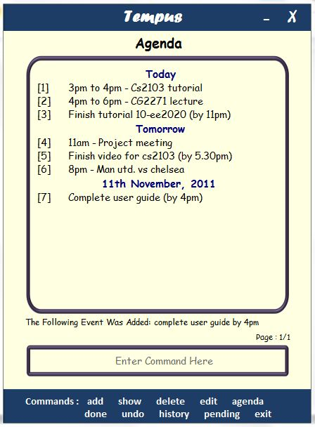

Tempus - To-Do Manager for Power Users
==================

Finding it difficult to keep track of all your appointments and meetings? We present to you Tempus- a to-do manager for the modern day power user who prefers using the keyboard to the mouse. Tempus is a free and user friendly organizer to ensure that you never miss a deadline again. Besides the usual capabilities of a task manager, Tempus comes with a host of other features such Quick Activation and Adding, Event Search, Task Archive, shortcut commands, auto complete, a reminder system and much more. What sets Tempus apart from other systems is a powerful yet easy to use Graphical User Interface (GUI) which supports an exhaustive list of commands, making it the right choice of task manager especially for those power users who want to add, view and organize their tasks- and their lives- quickly and effectively.
 

